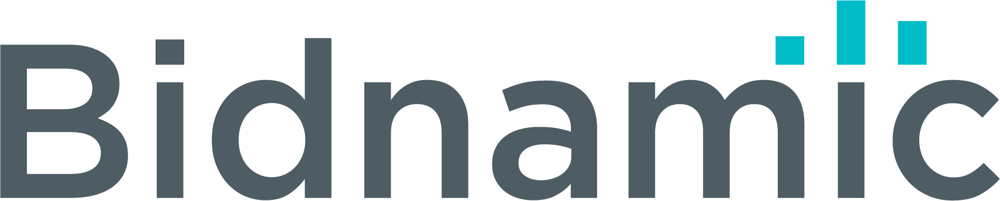

## Python Software Engineering Challenge

Our system ingests search term data from Google Ads API into a PostgreSQL database, via an AWS S3 Data Lake.

Once ingested we score each search term with its Return On Ad Spend (ROAS).

```text
ROAS = conversion value / cost
```

### Task

1. Some CSVs have been given (campaigns.csv, adgroups.csv and search_terms.csv), load them into a database.


2. Create some private end points to return the Top 10 Search Terms by ROAS for a campaign `structure_value` or adgroup `alias`.


### Hints

There are tools that can help you load CSVs into a database table easily.

The Top 10 Search Terms should be based on aggregated cost and conversion value data e.g:

| structure_value | search_term                               | total_cost | total_conversion_value | roas | 
|-----------------|-------------------------------------------|------------|------------------------|------|
| night watch     | black mens bike                           | 5          | 100                    | 20   |
| ranger          | women's high rider mountain bike with lock | 10         | 105                    | 10   |


| alias                 | search_term                    | total_cost | total_conversion_value | roas | 
|-----------------------|--------------------------------|------------|------------------------|------|
| Shift - Long - Name 1 | iphone refurbished             | 6          | 340                   | 56.7 |
| Shift - Long - Name 2 | google pixel 2 brand new black | 13         | 105                   | 8.1  |


### Bonus

We really value neatness and things being put in place to aid local development and continuous integration.

Needless to say, we like tests.


### Submission

Please fork this repo to complete the challenge, once done email back link to your repo.

Good luck we are rooting for you!